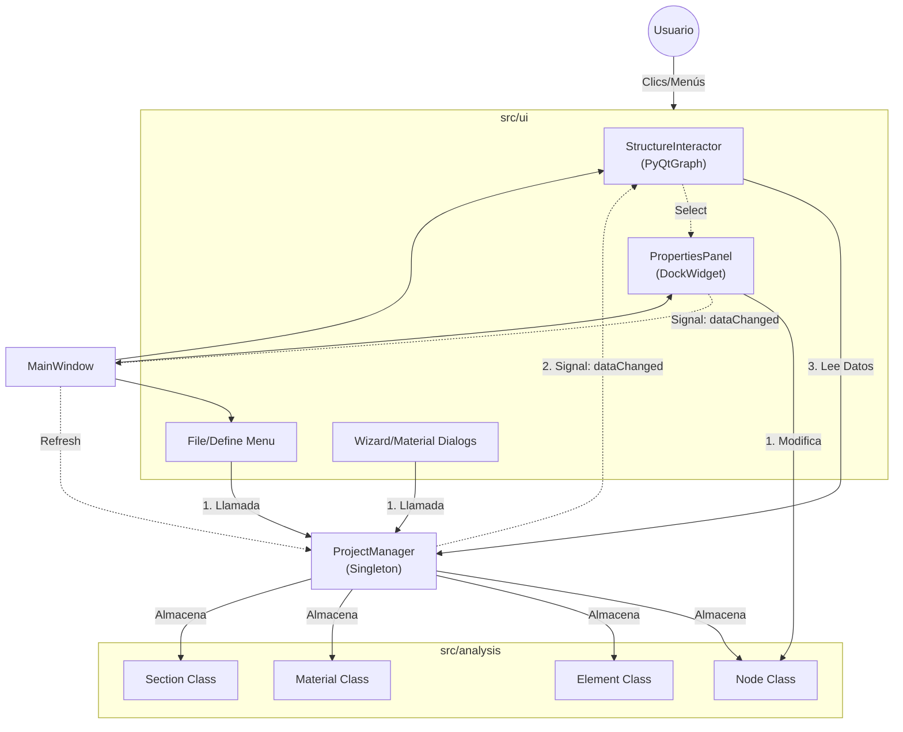
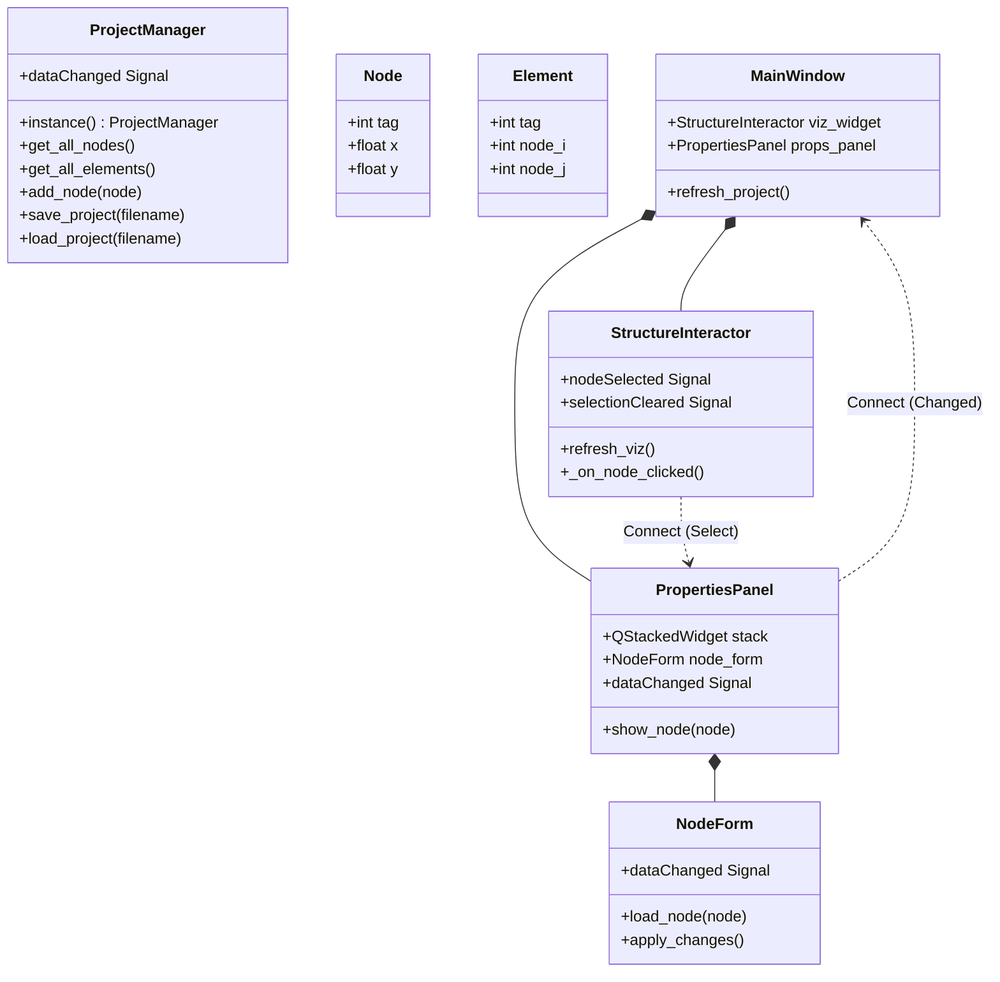

# Arquitectura del Proyecto AP-GUI

Este documento describe el flujo de datos y dependencias del sistema actual. Utiliza diagramas Mermaid para visualizar las interacciones.

## 🏗️ Estructura General
El proyecto sigue una arquitectura **Model-View-Controller (adaptada)** donde:
- **Model (Análisis)**: Gestiona la lógica de negocio (Nodos, Elementos, OpenSees).
- **View (UI)**: Muestra la información y captura inputs.
- **Controller/Manager**: El `ProjectManager` centraliza el estado y comunica cambios.

## 🧩 Mapa Detallado de Clases y Métodos
Detalle de las funciones implementadas hasta la fecha.

## 🔄 Flujo de Selección y Edición
Como interactúan los componentes cuando el usuario edita un nodo:

1.  **Selección**:
    *   Usuario hace clic en un Nodo en `StructureInteractor`.
    *   `StructureInteractor` emite `nodeSelected(node)`.
    *   `PropertiesPanel` recibe la señal, muestra `NodeForm` y carga los datos (`x, y`).

2.  **Edición**:
    *   Usuario cambia `x` a `5.0` y pulsa "Aplicar".
    *   `NodeForm` actualiza el objeto `node.x = 5.0` directamente.
    *   `NodeForm` emite `dataChanged`.
    *   `PropertiesPanel` re-emite `dataChanged`.
    *   `MainWindow` recibe la señal y llama a `ProjectManager.instance().dataChanged.emit()`.
    *   `StructureInteractor` se entera del cambio y repinta todo (el nodo se mueve).
