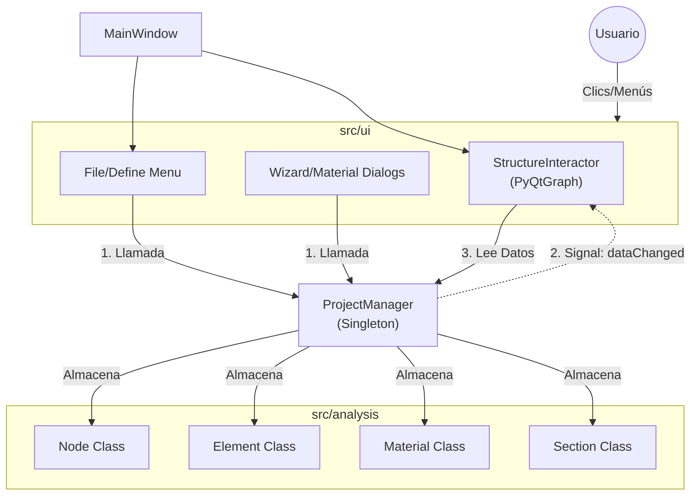
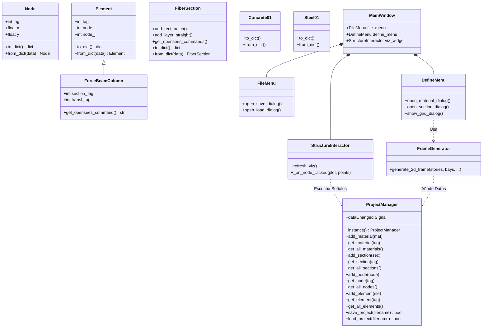
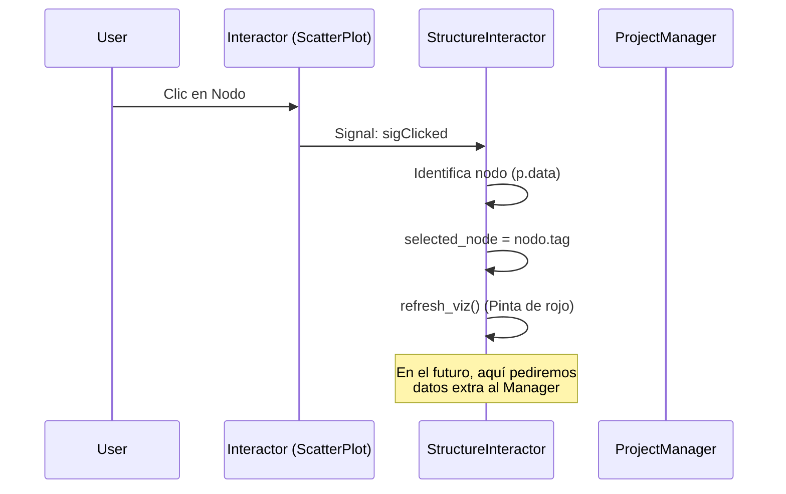

# Arquitectura del Proyecto AP-GUI

Este documento describe el flujo de datos y dependencias del sistema actual. Utiliza diagramas Mermaid para visualizar las interacciones.

## 🏗️ Estructura General
El proyecto sigue una arquitectura **Model-View-Controller (adaptada)** donde:
- **Model (Análisis)**: Gestiona la lógica de negocio (Nodos, Elementos, OpenSees).
- **View (UI)**: Muestra la información y captura inputs.
- **Controller/Manager**: El `ProjectManager` centraliza el estado y comunica cambios.

## 🧩 Mapa Detallado de Clases y Métodos
Detalle de las funciones implementadas hasta la fecha (Sesión de Persistencia).

## 🔄 Flujo de Datos Actual (Ej: Cargar Proyecto)

1.  **Usuario** hace clic en `Archivo > Cargar`.
2.  `FileMenu` abre diálogo y obtiene ruta del archivo.
3.  `FileMenu` llama a `ProjectManager.load_project(ruta)`.
4.  `ProjectManager` lee el JSON, instancia objetos (`Node`, `Element`, etc.) y los guarda.
5.  `ProjectManager` emite la señal **`dataChanged`**.
6.  `StructureInteractor` recibe la señal y ejecuta `refresh_viz()`.
7.  `StructureInteractor` pide la lista de nodos/elementos al `ProjectManager` y repinta la pantalla.

## 💾 Persistencia
Los objetos saben guardarse y cargarse a sí mismos mediante diccionarios:
- `to_dict()`: Objeto -> Diccionario (para JSON).
- `from_dict()`: Diccionario -> Objeto.

El `ProjectManager` orquesta esto iterando sobre sus listas.

## 🎨 Sistema de Selección (En Progreso)

