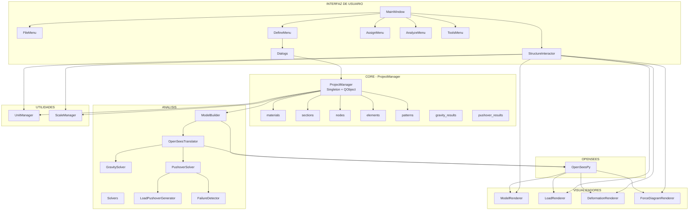

# Arquitectura del Proyecto AP-GUI

Este documento describe la arquitectura completa del sistema, incluyendo estructura de archivos, clases, funciones y flujo de datos.

## 1. Resumen Ejecutivo

AP-GUI es una aplicación de escritorio para análisis estructural 2D desarrollada en Python con PyQt6. Utiliza OpenSees (a través de openseespy) como motor de cálculo para análisis no lineales. La aplicación sigue un patrón MVC adaptado con un núcleo de análisis separado de la interfaz gráfica.

---

## 2. Estructura de Archivos

```
AP-GUI/
├── src/
│   ├── analysis/                    # Núcleo de análisis
│   │   ├── manager.py              # ProjectManager (Singleton)
│   │   ├── model_builder.py        # Constructor de modelo OpenSees
│   │   ├── opensees_translator.py  # Fachada de análisis
│   │   ├── node.py                 # Clase Node
│   │   ├── element.py              # Clases de elementos
│   │   ├── materials.py           # Clases de materiales
│   │   ├── sections.py             # Clases de secciones
│   │   ├── loads.py                # Clases de cargas
│   │   ├── frame_generator.py     # Generador de pórticos
│   │   ├── command_processor.py   # Procesador de comandos CLI
│   │   └── solvers/
│   │       ├── gravity_solver.py          # Análisis de gravedad
│   │       ├── pushover_solver.py         # Análisis pushover
│   │       ├── pushover_configurator.py   # Configuración pushover
│   │       ├── load_generator.py          # Generador de cargas laterales
│   │       └── failure_detector.py        # Detector de fallos
│   │
│   ├── ui/                          # Interfaz gráfica
│   │   ├── main_window.py           # Ventana principal
│   │   ├── dialogs/                 # Dialogos modales
│   │   │   ├── geometry_dialog.py
│   │   │   ├── material_dialog.py
│   │   │   ├── section_dialog.py
│   │   │   ├── pattern_dialog.py
│   │   │   ├── grid_dialog.py
│   │   │   ├── nodal_loads_dialog.py
│   │   │   ├── element_loads_dialog.py
│   │   │   ├── restraints_dialog.py
│   │   │   ├── self_weight_dialog.py
│   │   │   ├── pushover_dialog.py
│   │   │   ├── pushover_result_dialog.py
│   │   │   └── moment_curvature_dialog.py
│   │   ├── widgets/                 # Widgets reutilizables
│   │   │   ├── structure_interactor.py
│   │   │   ├── properties_panel.py
│   │   │   ├── scales_panel.py
│   │   │   ├── animation_toolbar.py
│   │   │   ├── material_forms.py
│   │   │   ├── section_forms.py
│   │   │   ├── properties_forms.py
│   │   │   ├── command_line.py
│   │   │   ├── command_console.py
│   │   │   ├── unit_spinbox.py
│   │   │   ├── unit_selector.py
│   │   │   └── section_preview.py
│   │   ├── visualizers/            # Renderizadores
│   │   │   ├── model_renderer.py
│   │   │   ├── load_renderer.py
│   │   │   ├── deformation_renderer.py
│   │   │   └── force_diagram_renderer.py
│   │   └── menus/                  # Barras de menú
│   │       ├── file_menu.py
│   │       ├── define_menu.py
│   │       ├── assign_menu.py
│   │       ├── analyze_menu.py
│   │       └── tools_menu.py
│   │
│   └── utils/                      # Utilidades
│       ├── units.py               # Gestor de unidades
│       └── scale_manager.py       # Gestor de escalas
│
├── main.py                         # Punto de entrada
├── model_debug.py                 # Debug del modelo OpenSees
└── *.json                         # Proyectos guardados
```

---

## 3. Core Analysis (analysis/)

### 3.1 Modelos de Datos

| Archivo | Clases Principales | Propósito |
|---------|------------------|-----------|
| `node.py` | `Node` | Define nodos con coordenadas (x, y), fixity constraints y masas. Serializa a JSON y OpenSees. |
| `element.py` | `Element`, `ForceBeamColumn`, `ForceBeamColumnHinge` | Elementos viga-columna con integración numérica. Soporta rotulas plásticas (Hinge). |
| `materials.py` | `Material`, `Concrete01`, `Steel01`, `Elastic`, `Hysteretic`, `HystereticSM` | Modelos de materiales uniaxiales para OpenSees. |
| `sections.py` | `Section`, `FiberSection`, `AggregatorSection`, `RectPatch`, `LayerStraight` | Secciones con distribución de fibras y secciones agregadas. |
| `loads.py` | `Load`, `NodalLoad`, `ElementLoad`, `LoadPattern` | Cargas nodales, distribuidas y patrones de carga. |

### 3.2 Gestión del Proyecto

**Clase:** `ProjectManager` (Singleton + QObject)

| Método | Propósito |
|--------|-----------|
| `add_node()`, `add_element()`, `add_material()`, `add_section()` | CRUD para entidades |
| `get_all_X()` | Lista todas las entidades de un tipo |
| `get_node(tag)`, `get_element(tag)`, etc. | Obtiene entidad por tag |
| `get_floor_data()` | Cache de topología del edificio por planta |
| `get_floor_masses()` | Calcula masas concentradas por planta |
| `save_project()` / `load_project()` | Persistencia a JSON |
| `dataChanged` (signal) | Notifica cambios a la UI |
| `mark_topology_dirty()` | Invalida cache de topología |

### 3.3 Constructores de Modelo

| Archivo | Clase | Propósito |
|---------|-------|----------|
| `model_builder.py` | `ModelBuilder` | Construye el modelo completo en OpenSees. Incluye lógica de freeze floors para análisis adaptativo. |
| `frame_generator.py` | `FrameGenerator` | Genera pórticos 2D regulares automáticamente. |
| `command_processor.py` | `CommandProcessor` | Procesa comandos CLI (analyze, clear, scale, etc.). |

### 3.4 Fachada de Análisis

**Clase:** `OpenSeesTranslator` (Facade Pattern)

| Método | Delega a |
|--------|----------|
| `build_model()` | `ModelBuilder` |
| `run_gravity_analysis()` | `GravitySolver` |
| `run_pushover_analysis()` | `PushoverSolver` |
| `run_adaptative_pushover()` | `PushoverSolver` |
| `run_modal_analysis()` | `PushoverSolver` |

### 3.5 Solvers

| Archivo | Clase | Propósito |
|---------|-------|----------|
| `gravity_solver.py` | `GravitySolver` | Análisis estático lineal. Extrae desplazamientos, reacciones y fuerzas. |
| `pushover_solver.py` | `PushoverSolver` | Organización del análisis pushover (monotónico + adaptativo). |
| `pushover_configurator.py` | `PushoverConfigurator` | Configura el motor matemático de OpenSees. Incluye fallback algorithms. |
| `load_generator.py` | `LoadPushoverGenerator` | Genera vectores de fuerza laterales (Modal, Uniforme). |
| `failure_detector.py` | `FailureDetector`, `FloorFailureState` | Detecta mecanismos de colapso. |

---

## 4. UI - Dialogs (ui/dialogs/)

### 4.1 Dialogos de Definición

| Dialogo | Propósito | Dependencias Clave |
|---------|-----------|-------------------|
| `material_dialog.py` | Definir materiales | `ProjectManager`, `material_forms` |
| `section_dialog.py` | Definir secciones | `ProjectManager`, `section_forms`, `section_preview` |
| `geometry_dialog.py` | Crear nodos y elementos manualmente | `ProjectManager`, `Node`, `ForceBeamColumn` |
| `pattern_dialog.py` | Gestionar patrones de carga | `ProjectManager`, `LoadPattern` |
| `grid_dialog.py` | Generar pórtico regular | `FrameGenerator` |

### 4.2 Dialogos de Asignación

| Dialogo | Propósito |
|---------|-----------|
| `nodal_loads_dialog.py` | Asignar cargas nodales (Fx, Fy, Mz) |
| `element_loads_dialog.py` | Asignar cargas distribuidas (wx, wy) |
| `restraints_dialog.py` | Aplicar restricciones (fixity) |
| `self_weight_dialog.py` | Generar cargas de peso propio |

### 4.3 Dialogos de Análisis

| Dialogo | Propósito |
|---------|-----------|
| `pushover_dialog.py` | Configurar y ejecutar análisis pushover |
| `pushover_result_dialog.py` | Visualizar curvas de capacidad |
| `moment_curvature_dialog.py` | Graficar M-phi en puntos de integración |

---

## 5. UI - Widgets (ui/widgets/)

### 5.1 Interacción Estructural

**Clase:** `StructureInteractor` (QWidget - Viewport principal)

| Atributo/Método | Propósito |
|-----------------|----------|
| `nodeSelected`, `selectionCleared`, `elementSelected` (signals) | Eventos de selección |
| `show_deformation(results)` | Mostrar estructura deformada |
| `set_visibility(type, visible)` | Toggle cargas, deformada, diagramas |
| `show_force_diagrams(type)` | Mostrar M/V/P |
| `current_results` | Cache de resultados |
| `active_pattern_tag` | Filtro de visualización por patrón |

**Composición (usa renderizadores):**
- `ModelRenderer` → Dibuja modelo geometría
- `LoadRenderer` → Dibuja flechas de carga
- `DeformationRenderer` → Dibuja estructura deformada
- `ForceDiagramRenderer` → Dibuja diagramas M/V/P

### 5.2 Paneles de Control

| Widget | Propósito |
|--------|-----------|
| `properties_panel.py` | `PropertiesPanel`: Muestra/edita propiedades del nodo/elemento seleccionado |
| `scales_panel.py` | `ScalesPanel`: Control de multiplicadores visuales |
| `animation_toolbar.py` | `AnimationToolbar`: Slider para animación de resultados pushover |
| `command_line.py` | `CommandLineWidget`: Input de comandos CLI |

### 5.3 Formularios de Entrada

| Widget | Propósito |
|--------|-----------|
| `material_forms.py` | Formularios para Concrete, Steel, Elastic, Hysteretic, HystereticSM |
| `section_forms.py` | Formularios para FiberSection y AggregatorSection |
| `properties_forms.py` | Formularios inline para editar propiedades |

### 5.4 Componentes de Soporte

| Widget | Propósito |
|--------|-----------|
| `unit_spinbox.py` | `UnitSpinBox`: QDoubleSpinBox con conversión de unidades |
| `unit_selector.py` | `UnitSelectorWidget`: ComboBox con presets de unidades |
| `section_preview.py` | `SectionPreview`: Preview visual de secciones fibras |

---

## 6. UI - Visualizers (ui/visualizers/)

| Renderer | Propósito |
|----------|-----------|
| `model_renderer.py` | Dibuja nodos y elementos. Símbolos por fixity. |
| `load_renderer.py` | Dibuja flechas de carga nodales y distribuidas. |
| `deformation_renderer.py` | Dibuja estructura deformada con interpolación Hermite. |
| `force_diagram_renderer.py` | Dibuja polígonos de diagramas M/V/P optimizado. |

---

## 7. UI - Menus (ui/menus/)

| Menu | Acciones Clave |
|------|---------------|
| `file_menu.py` | Nuevo Proyecto, Cargar, Guardar, Salir |
| `define_menu.py` | Materiales, Secciones, Geometría, Patrones |
| `assign_menu.py` | Restricciones, Cargas Nodales, Cargas Elementos |
| `analyze_menu.py` | Gravedad, Modal, Pushover, Ver Resultados |
| `tools_menu.py` | Generar Pórtico 2D, Generar Peso Propio |

---

## 8. UI - Main Window

**Clase:** `MainWindow` (QMainWindow)

| Componente | Descripción |
|-----------|-----------|
| `mdi_area` | Área MDI con múltiples viewports (StructureInteractor) |
| `menus` | FileMenu, DefineMenu, AssignMenu, AnalyzeMenu, ToolsMenu |
| `props_panel` | PropertiesPanel (dock derecho) |
| `scales_panel` | ScalesPanel (dock derecho) |
| `anim_toolbar` | AnimationToolbar (toolbar superior) |
| `pattern_combo` | Filtro de cargas por patrón |

---

## 9. Utils

### 9.1 Gestión de Unidades

**Clase:** `UnitManager` (Singleton + QObject)

| Enum | Descripción |
|------|-------------|
| `UnitType` | LENGTH, SECTION_DIM, FORCE, MOMENT, STRESS, DENSITY, DISTRIBUTED_FORCE, ACCELERATION, MASS |

| Método | Descripción |
|--------|-------------|
| `to_base(value, UnitType)` | Convierte de unidades actuales a base (N, m, Pa, kg) |
| `from_base(value, UnitType)` | Convierde de base a unidades actuales |
| `unitsChanged` (signal) | Notifica cambios a todos los UnitSpinBox |

### 9.2 Gestión de Escalas

**Clase:** `ScaleManager` (Singleton + QObject)

| Escala | Descripción |
|--------|-------------|
| `node_size` | Tamaño visual de nodos en píxeles |
| `load` | Escala de flechas de carga |
| `deformation` | Factor de exageración de deformada |
| `moment`, `shear`, `axial` | Escalas para diagramas de fuerza |

---

## 10. Diagrama de Relaciones (Mapa Mental)


```mermaid
graph TD
    subgraph UI["INTERFAZ DE USUARIO"]
        Main[MainWindow]
        FileMenu[FileMenu]
        DefineMenu[DefineMenu]
        AssignMenu[AssignMenu]
        AnalyzeMenu[AnalyzeMenu]
        ToolsMenu[ToolsMenu]
        Dialogs[Dialogs]
        Interactor[StructureInteractor]
    end

    subgraph CORE["CORE - ProjectManager"]
        PM[ProjectManager<br/>Singleton + QObject]
        Materials[materials]
        Sections[sections]
        Nodes[nodes]
        Elements[elements]
        Patterns[patterns]
        Gravity[gravity_results]
        Pushover[pushover_results]
    end

    subgraph Analysis["ANALISIS"]
        Builder[ModelBuilder]
        Translator[OpenSeesTranslator]
        Solvers[Solvers]
        GravitySolver[GravitySolver]
        PushoverSolver[PushoverSolver]
        LoadGen[LoadPushoverGenerator]
        FailureDet[FailureDetector]
    end

    subgraph OpenSees["OPENSEES"]
        OPS[OpenSeesPy]
    end

    subgraph Viz["VISUALIZADORES"]
        ModelR[ModelRenderer]
        LoadR[LoadRenderer]
        DeformR[DeformationRenderer]
        ForceR[ForceDiagramRenderer]
    end

    subgraph Utils["UTILIDADES"]
        Units[UnitManager]
        Scales[ScaleManager]
    end

    %% Conexiones UI -> Core
    Main --> FileMenu
    Main --> DefineMenu
    Main --> AssignMenu
    Main --> AnalyzeMenu
    Main --> ToolsMenu
    Main --> Interactor
    
    DefineMenu --> Dialogs
    Dialogs --> PM
    
    %% Core
    PM --> Materials
    PM --> Sections
    PM --> Nodes
    PM --> Elements
    PM --> Patterns
    
    %% Core -> Analysis
    PM --> Builder
    Builder --> Translator
    
    Translator --> GravitySolver
    Translator --> PushoverSolver
    
    PushoverSolver --> LoadGen
    PushoverSolver --> FailureDet
    
    %% Analysis -> OpenSees
    Builder --> OPS
    Translator --> OPS
    
    %% OpenSees -> Visualizers
    OPS --> ModelR
    OPS --> LoadR
    OPS --> DeformR
    OPS --> ForceR
    
    Interactor --> ModelR
    Interactor --> LoadR
    Interactor --> DeformR
    Interactor --> ForceR
    
    %% Utils
    PM --> Units
    PM --> Scales
    Interactor --> Units
    Interactor --> Scales
```

### Leyenda de Componentes

| Símbolo | Significado |
|---------|-------------|
| **Singleton** | Instancia única global |
| **(QObject)** | Soporta señales PyQt |
| **(signal)** | Emite notificaciones |

---

## 11. Flujo de Ejecución Típico

### 11.1 Creación de Modelo
1. Usuario abre `DefineMenu` → `MaterialDialog`, `SectionDialog`, `GeometryDialog`
2. Diálogos crean objetos Python y llaman a `ProjectManager.add_X()`
3. `ProjectManager.dataChanged` emite señal
4. Todos los `StructureInteractor` refrescan automáticamente

### 11.2 Análisis de Gravedad
1. Usuario ejecuta `AnalyzeMenu` → Gravedad
2. `AnalyzeMenu.run_gravity()` llama a `OpenSeesTranslator`
3. `OpenSeesTranslator.build_model()` → `ModelBuilder`
4. `OpenSeesTranslator.run_gravity_analysis()` → `GravitySolver`
5. Resultados → `ProjectManager.gravity_results`
6. `MainWindow.broadcast_results()` → todos los `StructureInteractor`
7. Visualizadores dibujan deformada

### 11.3 Análisis Pushover
1. Usuario abre `PushoverDialog` (configura parámetros)
2. Ejecuta `OpenSeesTranslator.run_adaptative_pushover()`
3. `PushoverSolver` itera:
   - Genera patrón de cargas (`LoadPushoverGenerator`)
   - Configura análisis (`PushoverConfigurator`)
   - Captura resultados paso a paso en `pushover_data/*.out`
   - Detecta fallos (`FailureDetector`)
   - Ejecuta freeze si adaptativo
4. Resultados → `ProjectManager.pushover_results`
5. `AnimationToolbar` habilita slider
6. `PushoverResultsWidget` dibuja curva capacidad

---

## 12. Clases y Funciones Principales

### Núcleo de Análisis

| Módulo | Clase/Función Exportada | Uso Primario |
|--------|------------------------|--------------|
| `manager.py` | `ProjectManager.instance()` | Singleton - acceso global |
| `opensees_translator.py` | `OpenSeesTranslator` | Fachada de análisis |
| `model_builder.py` | `ModelBuilder.build_model()` | Construye modelo OpenSees |
| `pushover_solver.py` | `PushoverSolver.run_adaptative_pushover()` | Pushover no lineal |

### UI

| Módulo | Clase | Descripción |
|-------|-------|------------|
| `main_window.py` | `MainWindow` | Ventana principal |
| `structure_interactor.py` | `StructureInteractor` | Viewport principal |
| `pushover_dialog.py` | `PushoverDialog` | Configuración pushover |
| `properties_panel.py` | `PropertiesPanel` | Panel editable |

### Utilidades

| Módulo | Clase/Función | Descripción |
|--------|--------------|------------|
| `units.py` | `UnitManager.instance()` | Conversión de unidades |
| `scale_manager.py` | `ScaleManager.instance()` | Control de escalas |

---

*Documento generado automáticamente para referencia de arquitectura.*