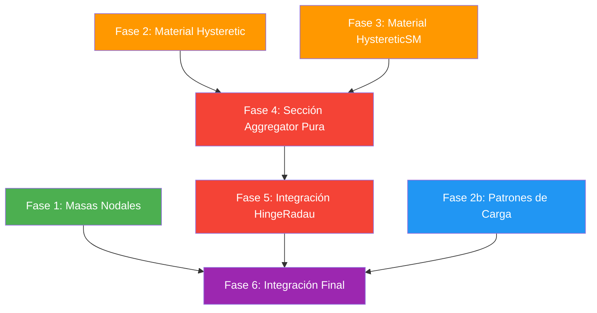

# 🗺️ Ruta de Implementación — Modelo de Calibración en AP-GUI

> **Objetivo:** Habilitar la ejecución del modelo de calibración (`Modelo\Modelo\*.tcl`) dentro de AP-GUI, cerrando todas las brechas de tipos de materiales, secciones, elementos y nodos.

---

## Mapa de Dependencias



> [!IMPORTANT]
> Las fases 1, 2, 2b y 3 son **independientes** entre sí y se pueden desarrollar en paralelo.  
> La Fase 4 depende de las Fases 2 y 3. La Fase 5 depende de la Fase 4.

---

## ✅ Fase 1: Masas Nodales en `Node` — COMPLETADA

### ¿Por qué?
El modelo de calibración asigna masa a **cada nodo** con `-mass mx my mrz`. Tu clase `Node` actual solo almacena `tag, x, y, fixity`. Sin masas nodales, no se puede hacer análisis modal ni dinámico correctamente.

### Conceptos clave
- En OpenSees 2D (ndm=2, ndf=3), las masas son: `mass_x`, `mass_y`, `mass_rz` (rotacional).
- El modelo TCL usa masas en x e y iguales, y rotacional = 0.
- Las masas se pasan al crear el nodo: `ops.node(tag, x, y, '-mass', mx, my, mrz)`

### Archivos a modificar

| Archivo | Cambio |
|---|---|
| [node.py](file:///c:/Users/alber/PythonProjects/AP-GUI/src/analysis/node.py) | Añadir campo `mass` (lista `[mx, my, mrz]`) al `__slots__` y constructor |
| [model_builder.py](file:///c:/Users/alber/PythonProjects/AP-GUI/src/analysis/model_builder.py#L68-L77) | Modificar `_build_nodes()` para pasar `-mass` si el nodo tiene masas definidas |
| [manager.py](file:///c:/Users/alber/PythonProjects/AP-GUI/src/analysis/manager.py#L337-L340) | Asegurar que `load_project()` deserializa las masas del JSON |

### Pasos detallados

1. **`node.py`** — Ampliar la clase `Node`:
   - Añadir `'mass'` al `__slots__`.
   - En el constructor: parámetro `mass=None`, que por defecto será `None` (= no tiene masas).
   - En `to_dict()`: serializar `self.mass` solo si no es `None`.
   - En `from_dict()`: leer `data.get("mass", None)`.
   - En `get_opensees_command()`: si `self.mass` no es None, añadir `'-mass' mx my mrz`.

2. **`model_builder.py`** — Modificar `_build_nodes()` (líneas 68-77):
   - Actualmente: `self.log_command('node', node.tag, node.x, node.y)`
   - Nuevo: si `node.mass` no es None → `self.log_command('node', node.tag, node.x, node.y, '-mass', *node.mass)`

3. **`manager.py`** — En `load_project()`:
   - Ya llama `Node.from_dict(n_data)`, así que si el paso 1 está bien, se carga automáticamente.

### Verificación
```
# Pseudocódigo de test
node = Node(1, 0.0, 3950.0, mass=[4.39, 4.39, 0.0])
assert node.mass == [4.39, 4.39, 0.0]

d = node.to_dict()
assert "mass" in d

node2 = Node.from_dict(d)
assert node2.mass == [4.39, 4.39, 0.0]
```

### Impacto en UI
- El diálogo de creación/edición de nodos necesitará campos para masas (pero puede posponerse si de momento solo creas nodos por código/JSON).

---

## ✅ Fase 2: Material `Hysteretic` — COMPLETADA

### ¿Por qué?
El modelo de calibración usa `uniaxialMaterial Hysteretic` para el acero (tag 2). Tu programa solo tiene `Steel01` y `Concrete01`. Son materiales con filosofías MUY distintas:

| | Steel01 | Hysteretic |
|---|---|---|
| Envolvente | Bilineal (Fy, E0, b) | **Multilineal por puntos** (3 puntos × 2 ramas) |
| Asimetría | Simétrica | Puede ser **asimétrica** (+ y − distintos) |
| Parámetros de daño | a1–a4 (isotrópico) | `pinchX, pinchY, damage1, damage2, beta` |

### Conceptos clave

La firma de OpenSees es:
```
uniaxialMaterial Hysteretic $matTag 
  $s1p $e1p $s2p $e2p $s3p $e3p     ← rama positiva (+): 3 puntos (stress, strain)
  $s1n $e1n $s2n $e2n $s3n $e3n     ← rama negativa (−): 3 puntos
  $pinchX $pinchY $damage1 $damage2  ← reglas de histéresis
  <$beta>                            ← opcional
```

En el modelo TCL (`materials.tcl`, línea 17):
```tcl
uniaxialMaterial Hysteretic $Acero 
  570 0.002875 570.1 0.055 0.0 0.09       ← positiva
  -570 -0.002875 -570.1 -0.055 0.0 -0.09  ← negativa
  0.0 0.0 0.0 0.0                         ← pinch/damage
```

### Archivos a modificar

| Archivo | Cambio |
|---|---|
| [materials.py](file:///c:/Users/alber/PythonProjects/AP-GUI/src/analysis/materials.py) | Crear clase `Hysteretic(Material)` |
| [model_builder.py](file:///c:/Users/alber/PythonProjects/AP-GUI/src/analysis/model_builder.py#L79-L101) | Manejar `Hysteretic` en `_build_materials()` |
| [manager.py](file:///c:/Users/alber/PythonProjects/AP-GUI/src/analysis/manager.py#L321-L329) | Reconocer `"Hysteretic"` en `load_project()` |

### Pasos detallados

1. **`materials.py`** — Crear la clase `Hysteretic`:
   - Hereda de `Material`.
   - `__slots__`: los 6 puntos de la envolvente positiva (`s1p, e1p, s2p, e2p, s3p, e3p`), los 6 de la negativa (`s1n, e1n, ...`), y los parámetros de histéresis (`pinch_x, pinch_y, damage1, damage2, beta`).
   - Total: **17 parámetros** específicos (+ tag, name, rho del padre).
   - `get_opensees_args()`: devuelve `["Hysteretic", tag, s1p, e1p, s2p, e2p, s3p, e3p, s1n, e1n, s2n, e2n, s3n, e3n, pinch_x, pinch_y, damage1, damage2]` + beta si no es None.
   - `to_dict()` / `from_dict()`: serialización completa.

2. **`model_builder.py`** — En `_build_materials()`:
   - Añadir: `from src.analysis.materials import ..., Hysteretic`
   - No requiere lógica especial: `mat.get_opensees_args()` ya devuelve los args correctos, y el flujo existente con `self.log_command('uniaxialMaterial', *args)` funcionará.
   - Si el `Hysteretic` tiene `minmax`, la lógica de wrapping ya existente la manejaría.

3. **`manager.py`** — En `load_project()`:
   - Añadir un `elif tipo == "Hysteretic":` que llame a `Hysteretic.from_dict(m_data)`.

### Verificación
```
# Crear material como en el TCL
mat = Hysteretic(2, "Acero",
    s1p=570, e1p=0.002875, s2p=570.1, e2p=0.055, s3p=0.0, e3p=0.09,
    s1n=-570, e1n=-0.002875, s2n=-570.1, e2n=-0.055, s3n=0.0, e3n=-0.09,
    pinch_x=0.0, pinch_y=0.0, damage1=0.0, damage2=0.0)

args = mat.get_opensees_args()
assert args[0] == "Hysteretic"
assert len(args) == 18  # type + tag + 16 params
```

---

## ✅ Fase 2b: Patrones de Carga Múltiples — COMPLETADA

### ¿Por qué?
El modelo de calibración usa **4 patterns** con distintos factores (`-fact 1.0`, `-fact 0.15`):

```tcl
pattern Plain 1 1 -fact 1.0 { ... }  ← Peso propio + sobrecarga
pattern Plain 2 1 -fact 1.0 { ... }  ← Carga muerta adicional
pattern Plain 3 1 -fact 0.15 { ... } ← Carga viva (con factor ψ)
pattern Plain 4 1 { ... }            ← Pushover lateral
```

Tu programa actual solo crea UN pattern (tag 1) con timeSeries Linear (tag 1). No existe el concepto de "grupo de cargas con factor".

### Conceptos clave

- Un `pattern` en OpenSees agrupa cargas que se aplican simultáneamente bajo una misma `timeSeries`.
- El `-fact` es un **factor de escala** que multiplica todas las cargas dentro del pattern.
- Para el Pushover, tu programa ya crea patterns adicionales en el solver. Pero para la **gravedad**, necesitas poder definir múltiples patterns desde el proyecto.

### Diseño recomendado

Crear un concepto de **`LoadPattern`** o **`LoadCase`** que agrupe cargas:

| Campo | Descripción |
|---|---|
| `tag` | ID único del pattern |
| `name` | Nombre descriptivo ("Peso Propio", "Sobrecarga"...) |
| `time_series_tag` | Referencia a la timeSeries |
| `factor` | Factor de escala (`-fact`) |
| `loads` | Lista de `NodalLoad` y `ElementLoad` que pertenecen a este pattern |

### Archivos a modificar

| Archivo | Cambio |
|---|---|
| [loads.py](file:///c:/Users/alber/PythonProjects/AP-GUI/src/analysis/loads.py) | Crear clase `LoadPattern` |
| [manager.py](file:///c:/Users/alber/PythonProjects/AP-GUI/src/analysis/manager.py) | Gestionar `LoadPattern` en vez de cargas sueltas |
| [model_builder.py](file:///c:/Users/alber/PythonProjects/AP-GUI/src/analysis/model_builder.py#L172-L184) | Iterar por patterns en `_build_patterns()` |

### Pasos detallados

1. **`loads.py`** — Crear `LoadPattern`:
   - `__slots__ = ['tag', 'name', 'ts_tag', 'factor', 'loads']`
   - `loads`: lista de `Load` (tanto `NodalLoad` como `ElementLoad`)
   - `to_dict()` / `from_dict()`: serialización con la lista de cargas incluida.

2. **`manager.py`**:
   - Cambiar `self.load = {}` por `self.load_patterns = {}` (o mantener ambos para retrocompatibilidad).
   - Métodos: `add_load_pattern()`, `get_all_load_patterns()`, etc.

3. **`model_builder.py`** — `_build_patterns()`:
   - Iterar por cada `LoadPattern` del manager.
   - Para cada uno: crear `timeSeries`, luego `pattern Plain tag ts_tag -fact factor { ... }`.
   - Dentro del pattern, aplicar cada carga.

> [!WARNING]
> Este cambio tiene impacto en la UI existente (diálogos de cargas) y en los solvers (Gravity, Pushover). Planifica con cuidado qué rompe.

### Verificación
- Cargar un proyecto con múltiples patterns.
- Verificar en `model_debug.py` que se generan los patterns con sus factores correctos.

---

## Fase 3: Material `HystereticSM` 🟠 Media

### ¿Por qué?
Las secciones del modelo de calibración definen **leyes Momento-Curvatura** directamente como materiales `HystereticSM`. Este material es parecido al `Hysteretic` pero con una envolvente de **4 puntos** por rama (en vez de 3) y parámetros adicionales de "smooth" y daño.

### Conceptos clave

La firma de OpenSees es:
```
uniaxialMaterial HystereticSM $matTag
  $s1p $e1p $s2p $e2p $s3p $e3p $s4p $e4p   ← rama positiva: 4 puntos
  $s1n $e1n $s2n $e2n $s3n $e3n $s4n $e4n   ← rama negativa: 4 puntos
  $pinchX $pinchY $damage1 $damage2 $beta
```

Ejemplo del archivo `Sections.tcl` (columna C11, línea 4):
```tcl
uniaxialMaterial HystereticSM 16 
  30088475 1.9e-06 115584583 3.6206e-05 117943452 0.000369487 0 0.000819634
  -30088475 -1.9e-06 -115584583 -3.6206e-05 -117943452 -0.000369487 0 -0.000819634
  1 1 0 0 0.5
```

Los 4 puntos representan la curva M-φ:
1. **Punto de fisuración** (M_cr, φ_cr)
2. **Punto de plastificación** (M_y, φ_y) 
3. **Punto de resistencia máxima** (M_u, φ_u)
4. **Punto de rotura** (M=0, φ_ult)  ← caída a cero

### Archivos a modificar

| Archivo | Cambio |
|---|---|
| [materials.py](file:///c:/Users/alber/PythonProjects/AP-GUI/src/analysis/materials.py) | Crear clase `HystereticSM(Material)` |
| [model_builder.py](file:///c:/Users/alber/PythonProjects/AP-GUI/src/analysis/model_builder.py) | Manejar `HystereticSM` en `_build_materials()` (misma lógica genérica) |
| [manager.py](file:///c:/Users/alber/PythonProjects/AP-GUI/src/analysis/manager.py#L321-L329) | Reconocer `"HystereticSM"` en `load_project()` |

### Pasos detallados

1. **`materials.py`** — Crear `HystereticSM`:
   - Hereda de `Material`.
   - **8 puntos de envolvente** (4 positivos + 4 negativos): `s1p, e1p, s2p, e2p, s3p, e3p, s4p, e4p` + rama negativa.
   - Parámetros de histéresis: `pinch_x, pinch_y, damage1, damage2, beta`.
   - Total: **21 parámetros** específicos.
   - `get_opensees_args()`: devuelve la lista completa en orden.
   - `to_dict()` / `from_dict()`: serialización completa.

> [!TIP]
> Considera usar una estructura interna con listas en vez de 21 atributos individuales. Por ejemplo:
> - `positive_envelope = [(s1p, e1p), (s2p, e2p), (s3p, e3p), (s4p, e4p)]`
> - `negative_envelope = [(s1n, e1n), ...]`
> - `hysteresis_params = [pinchX, pinchY, damage1, damage2, beta]`
>
> Esto es más limpio y extensible, pero recuerda que `__slots__` necesita adaptarse.

2. **`model_builder.py`** y **`manager.py`**: misma mecánica que en Fase 2.

### Verificación
```
# Material como en Sections.tcl (columna C11)
mat = HystereticSM(16, "MC_C11",
    s1p=30088475, e1p=1.9e-06, ..., beta=0.5)
    
args = mat.get_opensees_args()
assert args[0] == "HystereticSM"
assert args[1] == 16  # tag
# Verificar que el total de params es correcto
```

### Relación con la Fase 2
> `HystereticSM` y `Hysteretic` son materiales distintos en OpenSees, pero conceptualmente similares. Podrías crear una **clase base compartida** (por ejemplo `BaseHysteretic`) que tenga la lógica de envolvente, y que ambas hereden con distinto número de puntos. Pero no es obligatorio — dos clases independientes también funciona bien si prefieres simplicidad.

---

## ✅ Fase 4: Sección `Aggregator` Pura (Ley M-φ) — COMPLETADA

### ¿Por qué?
El modelo de calibración **NO usa secciones de fibras**. En su lugar, define cada sección como:

```tcl
section Aggregator $secTag $matP P $matMz Mz
```

Donde:
- `$matP` → material elástico que gobierna la respuesta **axial** (P)
- `$matMz` → material `HystereticSM` que gobierna la respuesta a **Momento** (Mz)

Tu programa actual SÍ usa `Aggregator`, pero como wrapper de una `FiberSection`:
```python
# Tu código actual (model_builder.py, línea 137):
section Aggregator secTag shearMat Vy -section fiberTag
#                                     ^^^^^^^^^^^^^^
#                                     Wrapper de FiberSection
```

Lo que necesitas es **otro tipo** de Aggregator que `NO` envuelva una FiberSection, sino que combine directamente materiales uniaxiales para cada grado de libertad.

### Conceptos clave

En OpenSees, `section Aggregator` tiene dos modos:

| Modo | Sintaxis | Tu programa |
|---|---|---|
| **Con sección base** | `section Aggregator tag mat1 dof1 -section baseSecTag` | ✅ Ya lo haces |
| **Sin sección base** | `section Aggregator tag mat1 dof1 mat2 dof2 ...` | ❌ **Falta** |

En el modelo de calibración, el modo es el segundo:
```tcl
section Aggregator 1  100 P  16 Mz
#                     ^^^      ^^^
#                   mat axial  mat momento-curvatura
```

### Diseño recomendado

Crear una nueva clase `AggregatorSection(Section)` que represente este concepto:

```
AggregatorSection
├── tag, name  (heredados de Section)
├── components: lista de tuplas [(mat_tag, dof_code), ...]
│   ejemplo: [(100, "P"), (16, "Mz")]
└── base_section_tag: int | None  (None = modo puro, int = wrapping)
```

### Archivos a modificar

| Archivo | Cambio |
|---|---|
| [sections.py](file:///c:/Users/alber/PythonProjects/AP-GUI/src/analysis/sections.py) | Crear clase `AggregatorSection(Section)` |
| [model_builder.py](file:///c:/Users/alber/PythonProjects/AP-GUI/src/analysis/model_builder.py#L103-L137) | Manejar `AggregatorSection` en `_build_sections()` |
| [manager.py](file:///c:/Users/alber/PythonProjects/AP-GUI/src/analysis/manager.py#L331-L335) | Reconocer `"AggregatorSection"` en `load_project()` |

### Pasos detallados

1. **`sections.py`** — Crear `AggregatorSection`:
   - Hereda de `Section`.
   - `__slots__ = ['components', 'base_section_tag']`
   - `components`: lista de tuplas `(material_tag: int, dof_code: str)`.
     - `dof_code` puede ser: `"P"`, `"Mz"`, `"Vy"`, `"My"`, `"Vz"`, `"T"`.
   - `base_section_tag`: si es `None`, es Aggregator puro. Si tiene valor, es wrapper.
   - `to_dict()` / `from_dict()`: serialización.

2. **`model_builder.py`** — `_build_sections()`:
   - Añadir un `elif isinstance(sec, AggregatorSection):`.
   - Si `sec.base_section_tag` es None (caso del modelo de calibración):
     ```python
     # Construir: section Aggregator tag mat1 dof1 mat2 dof2 ...
     args = [sec.tag]
     for mat_tag, dof_code in sec.components:
         args.extend([mat_tag, dof_code])
     self.log_command('section', 'Aggregator', *args)
     ```
   - Si `sec.base_section_tag` tiene valor:
     ```python
     args = [sec.tag]
     for mat_tag, dof_code in sec.components:
         args.extend([mat_tag, dof_code])
     args.extend(['-section', sec.base_section_tag])
     self.log_command('section', 'Aggregator', *args)
     ```

3. **Refactorizar** el `FiberSection` existente:
   - Actualmente, `model_builder.py` crea internamente un Aggregator al construir una FiberSection (líneas 106-137). 
   - Decisión a tomar: ¿Mantener ese código inline para FiberSection, o migrar ese wrapping a un `AggregatorSection` que se genere automáticamente?
   - **Recomendación**: por ahora, mantener el código inline para FiberSection (no romper lo que funciona) y crear `AggregatorSection` como clase nueva independiente. En el futuro puedes unificar.

> [!NOTE]
> La `AggregatorSection` **no calcula `get_mass_per_length()`** como la `FiberSection`, porque no tiene geometría de fibras. Si necesitas masas para elementos con este tipo de sección, tendrás que asignarlas por otro camino (por ejemplo, `mass_density` en el elemento o masas nodales directas).

### Verificación
```
# Sección como en Sections.tcl (columna C11)
sec = AggregatorSection(1, "C11", 
    components=[(100, "P"), (16, "Mz")])

# Debería generar: section Aggregator 1 100 P 16 Mz
args = sec.get_opensees_args()  # o verificar en model_debug.py
```

---

## Fase 5: Integración `HingeRadau` en `ForceBeamColumn` 🔴 Compleja

### ¿Por qué?
Todos los elementos del modelo de calibración usan `HingeRadau`:

```tcl
element forceBeamColumn $eleTag $iNode $jNode $transfTag HingeRadau $secI $lpI $secJ $lpJ $secE
```

Tu `ForceBeamColumn` solo soporta Lobatto con un número uniforme de puntos de integración y **una sola sección**.

### Conceptos clave

| | Lobatto (tu código actual) | HingeRadau (modelo calibración) |
|---|---|---|
| **Filosofía** | Plasticidad **distribuida** | Plasticidad **concentrada** (rótulas plásticas) |
| **Secciones** | 1 sección para todo el elemento | **3 secciones**: rótula I, rótula J, tramo elástico E |
| **Longitud plástica** | No aplica (se distribuye) | `lpI` y `lpJ` (longitud de rótula en cada extremo) |
| **Puntos de integración** | N puntos (definido por usuario) | Automático (4 puntos internos) |

La integración `HingeRadau` concentra la plasticidad en zonas de longitud `lp` en los extremos. El interior del elemento usa una sección elástica o distinta.

### Diseño recomendado

**Opción A** (recomendada): Añadir un nuevo tipo de integración al `ForceBeamColumn` existente.

**Opción B**: Crear una subclase `ForceBeamColumnHinge(ForceBeamColumn)`.

La **Opción A** es preferible porque el elemento en OpenSees sigue siendo `forceBeamColumn` — lo que cambia es la integración. Pero los datos necesarios son TAN distintos (3 secciones + 2 Lp vs 1 sección + N puntos) que **la Opción B es más limpia** desde el punto de vista de separación de datos.

### Propuesta: Opción B — Subclase `ForceBeamColumnHinge`

```
ForceBeamColumnHinge(Element)
├── tag, node_i, node_j  (heredados)
├── transf_tag
├── section_i_tag    ← sección de la rótula en nodo I
├── lp_i             ← longitud plástica en nodo I
├── section_j_tag    ← sección de la rótula en nodo J
├── lp_j             ← longitud plástica en nodo J
├── section_e_tag    ← sección del tramo interior (elástico)
├── mass_density
└── integration_type = "HingeRadau"  (podría soportar HingeMidpoint, etc.)
```

### Archivos a modificar

| Archivo | Cambio |
|---|---|
| [element.py](file:///c:/Users/alber/PythonProjects/AP-GUI/src/analysis/element.py) | Crear clase `ForceBeamColumnHinge(Element)` |
| [model_builder.py](file:///c:/Users/alber/PythonProjects/AP-GUI/src/analysis/model_builder.py#L139-L170) | Manejar `ForceBeamColumnHinge` en `_build_elements()` |
| [manager.py](file:///c:/Users/alber/PythonProjects/AP-GUI/src/analysis/manager.py#L342-L346) | Reconocer `"ForceBeamColumnHinge"` en `load_project()` |

### Pasos detallados

1. **`element.py`** — Crear `ForceBeamColumnHinge`:
   - Hereda de `Element` (NO de `ForceBeamColumn`, porque los datos son completamente distintos).
   - `__slots__ = ['transf_tag', 'section_i_tag', 'lp_i', 'section_j_tag', 'lp_j', 'section_e_tag', 'mass_density']`
   - `to_dict()`: tipo `"ForceBeamColumnHinge"`, serializar todo.
   - `from_dict()`: constructor inverso.

2. **`model_builder.py`** — `_build_elements()`:
   - Añadir: `from src.analysis.element import ..., ForceBeamColumnHinge`
   - Añadir un bloque `elif isinstance(ele, ForceBeamColumnHinge):`:
     ```python
     # En OpenSees la sintaxis es:
     # element forceBeamColumn tag iNode jNode transfTag HingeRadau secI lpI secJ lpJ secE
     self.log_command('element', 'forceBeamColumn',
         ele.tag, ele.node_i, ele.node_j, ele.transf_tag,
         'HingeRadau',
         ele.section_i_tag, ele.lp_i,
         ele.section_j_tag, ele.lp_j,
         ele.section_e_tag)
     ```
   - **No crea `beamIntegration`** separado — HingeRadau se pasa inline al crear el elemento.

3. **`manager.py`** — En `load_project()`:
   - Añadir `elif e_data.get("type") == "ForceBeamColumnHinge":`.

### Verificación
```
# Elemento como en elements.tcl (columna C11, línea 3)
# element forceBeamColumn 49 45 12 1 HingeRadau $C11 $LpC11 $C11 $LpC11 $C11
ele = ForceBeamColumnHinge(
    tag=49, node_i=45, node_j=12, transf_tag=1,
    section_i_tag=1, lp_i=176.5043,
    section_j_tag=1, lp_j=176.5043,
    section_e_tag=1)

# Verificar en model_debug.py que genera:
# element('forceBeamColumn', 49, 45, 12, 1, 'HingeRadau', 1, 176.5043, 1, 176.5043, 1)
```

> [!TIP]
> En el modelo de calibración, muchos elementos usan la **misma sección** para I, J y E (`$C11 $LpC11 $C11 $LpC11 $C11`). Esto es normal: la misma ley M-φ para ambos extremos y el interior. Tu clase soporta esto naturalmente porque cada campo es un tag independiente.

### Impacto en otros módulos

- **Renderizado 3D (viewport)**: El renderer dibuja elementos como líneas entre nodo I y nodo J. Esto NO cambia — sigue siendo un elemento entre dos nodos.
- **Diagramas de fuerzas**: Los `forceBeamColumn` con HingeRadau devuelven fuerzas de sección de la misma manera que con Lobatto. El `ForceDiagramRenderer` debería funcionar igual.
- **Topología de pisos**: El `get_floor_data()` identifica columnas/vigas por orientación de nodos. Esto no cambia.

---

## Fase 6: Integración Final y Script de Calibración 🟣

### ¿Por qué?
Una vez implementadas las fases 1-5, necesitas un mecanismo para **cargar** el modelo TCL de calibración en tu programa. Hay dos opciones:

### Opción A: Crear el modelo programáticamente (JSON)
Traducir manualmente el `.tcl` a un archivo `.json` de AP-GUI con la estructura correcta. Esto es lo más directo.

### Opción B: Parser de TCL (más ambicioso)
Crear un importador que lea los `.tcl` y genere los objetos Python automáticamente. Esto es más trabajo pero más reutilizable.

### Recomendación: Opción A primero
Crear un script Python (`create_calibration_model.py`) que:
1. Instancie el `ProjectManager`.
2. Cree todos los materiales (`Concrete01`, `Hysteretic`, `Elastic`, `HystereticSM` × 14).
3. Cree todas las secciones `AggregatorSection` (14 + duplicados).
4. Cree los 46 nodos con masas.
5. Cree los 60 elementos `ForceBeamColumnHinge`.
6. Cree los patterns de carga con sus factores.
7. Guarde como `.json`.

### Verificación final
- Cargar el JSON en AP-GUI.
- Ejecutar `build_model()` → verificar que `model_debug.py` coincide con el TCL original.
- Ejecutar análisis modal → comparar frecuencias.
- Ejecutar Pushover → comparar curva de capacidad.

---

## Resumen de Esfuerzo Estimado

| Fase | Complejidad | Archivos | Dependencia |
|---|---|---|---|
| ~~1. Masas Nodales~~ | ✅ **COMPLETADA** | `node.py`, `model_builder.py`, `geometry_dialog.py`, `properties_forms.py`, `units.py` | — |
| ~~2. Material Hysteretic~~ | ✅ **COMPLETADA** | `materials.py`, `model_builder.py`, `manager.py` | — |
| ~~2b. Patrones de Carga~~ | ✅ **COMPLETADA** | 3 | Ninguna |
| 3. Material HystereticSM | 🟠 Media | 3 | Ninguna |
| ~~4. Sección Aggregator Pura~~ | ✅ **COMPLETADA** | 3 | Fases 2+3 |
| 5. Integración HingeRadau | 🔴 Compleja | 3 | Fase 4 |
| 6. Integración Final | 🟡 Media | 1-2 | Todas |

### Orden recomendado de implementación
```
Semana 1: Fase 1 (masas) + Fase 2 (Hysteretic) + Fase 3 (HystereticSM)
Semana 2: Fase 4 (AggregatorSection) + Fase 2b (Patterns)
Semana 3: Fase 5 (HingeRadau) + Fase 6 (Integración)
```

> [!CAUTION]
> Cada fase debe verificarse **independientemente** antes de avanzar. No acumules cambios sin probar: la depuración se vuelve exponencialmente más difícil si introduces 6 tipos nuevos de golpe y algo falla.
